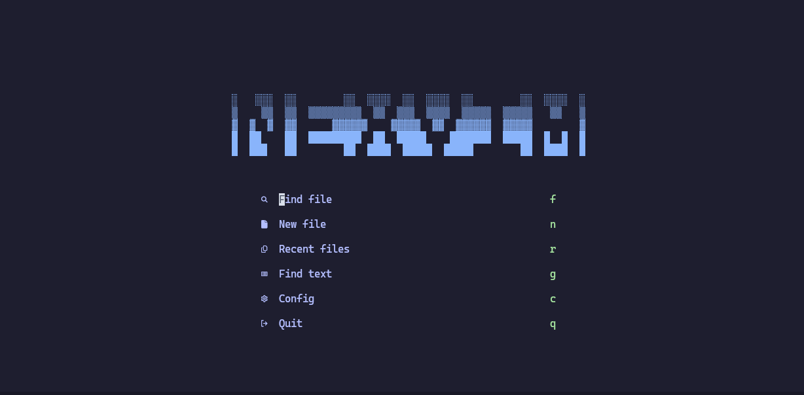

# NexVim

NexVim is a beginner-friendly Neovim configuration inspired by popular distributions like Kickstart.nvim and LazyVim. It provides an organized, modern setup that’s easy to use and customize, helping new users get started with Neovim without the hassle of complex configuration. Perfect for those who want a smooth and efficient Neovim experience out of the box.

## Screenshots


*Example of the NexVim interface*

## Installation

Clone this repository to your `~/.config/nvim/` directory:

```bash
git clone https://github.com/username/NexVim.git ~/.config/nvim
```

## Contributing

Contributions are welcome! If you'd like to improve NexVim or suggest new features, please follow these steps:

1. **Fork the repository** on GitHub.
2. **Clone your fork** to your local machine.
   ```bash
   git clone https://github.com/yourusername/NexVim.git
   ```
3. **Create a new branch** for your feature or bugfix.
   ```bash
   git checkout -b feature-name
   ```
4. **Make your changes**, ensuring to write clear commit messages.
5. **Push your changes** to your fork.
   ```bash
   git push origin feature-name
   ```
6. **Open a pull request** on GitHub. Be sure to explain your changes clearly.

We follow the [Contributor Covenant Code of Conduct](https://www.contributor-covenant.org/) and encourage all participants to be respectful and inclusive.
