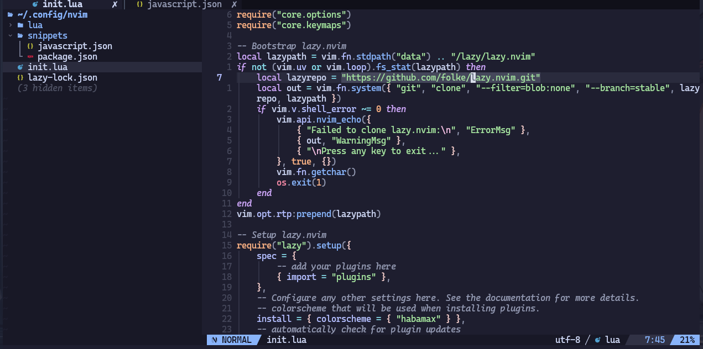

# NexVim

NexVim is a beginner-friendly Neovim configuration inspired by popular configuration [Kickstart.nvim](https://github.com/nvim-lua/kickstart.nvim) and a popular distro [LazyVim](https://github.com/LazyVim/LazyVim). It provides an organized, modern setup that’s easy to use and customize, helping new users get started with Neovim without the hassle of complex configuration. Perfect for those who want a smooth and efficient Neovim experience out of the box.



*Example of the NexVim interface*

## 📦 Requirements

To use NexVim, make sure your system meets the following requirements:

- **Neovim >= 0.9.0**
- **Git >= 2.19.0**
- **A [Nerd Font](https://www.nerdfonts.com/)** _(optional)_

## 🛠️ Installation

Clone this repository to your `~/.config/nvim/` directory:

```bash
git clone https://github.com/icoderarely/NexVim.git ~/.config/nvim
```

Once you’ve cloned the repository and installed any necessary dependencies, open Neovim:
```bash
nvim
```

## 📂 File Structure

<pre>
~/.config/nvim
├── lua
│   ├── core
│   │   ├── keymaps.lua
│   │   └── options.lua
│   │── plugins
│   │   ├── plugin1.lua
│   │   ├── **
│   │   └── plugin2.lua
│   └── snippets
│       ├── language.lua
│       └── package.json
└── init.lua
</pre>

## 🌱 Contributing

Contributions are welcome! If you'd like to improve NexVim or suggest new features, please follow these steps:

1. **Fork the repository** on GitHub.
2. **Clone your fork** to your local machine.
   ```bash
   git clone https://github.com/icoderarely/NexVim.git
   ```
3. **Create a new branch** for your feature or bugfix.
   ```bash
   git checkout -b feature-name
   ```
4. **Make your changes**, ensuring to write clear commit messages.
5. **Push your changes** to your fork.
   ```bash
   git push origin feature-name
   ```
6. **Open a pull request** on GitHub. Be sure to explain your changes clearly.

We follow the [Contributor Covenant Code of Conduct](https://www.contributor-covenant.org/) and encourage all participants to be respectful and inclusive.

## 🚧 Work in Progress

- [ ] Add documents explaining which plugins are used and what do they do.
